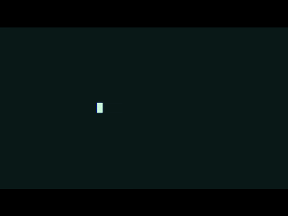

<link rel="stylesheet" href="/main.css"/>

# Terminal




Terminal, Console, Command line, this is where you enter commands into the computer.

It's often faster to do things through the terminal, but not always easier, so it's best to get familiar with it.

## Installing a Terminal Emulator

  macOS, and linux come with Terminals, so you don't _really_ need to install one.

  There are better ones that the default, though, and they may make things easier for you.
    
  macOS: [iTerm2](https://www.iterm2.com/)

  Gnome/Linux: [Terminator](https://gnome-terminator.org/)

  ```BASH
  sudo apt install terminator
  ```

## Shell

  The shell or Command-line interpreter, accepts commands and _interprets_ them for the system.

  ### Shells
  There can be multiple Shells on a system.
  These will be configured in `/etc/shells` a Linux / UNIX text file.
  ```
  # /etc/shells: valid login shells
  /bin/csh
  /bin/sh
  /usr/bin/es
  /usr/bin/rc
  /usr/bin/tcsh
  /bin/tcsh
  /bin/dash
  /bin/bash
  /usr/local/bin/fish
  ```
  
  ### Changing Shells

  You can change the current Shell with the `chsh` command.

  The `-s` flag is the name (path) to the shell that you would like to use.

  ```BASH
  chsh -s /usr/local/bin/fish
  ```

  ### Bash
  BASH (Bourne Again SHell) is the most popular shell, likely because it is the default on most GNU Linux machines, and previously on osX (macOS).

  ### ZSH
  ZSH (which is an extension of BASH) has become a favorite amongst Developers for it's ease of customisation and scripting.

  ZSH is now the default on macOS, and seems to be gaining popularity in the Linux community as well.

  #### To install ZSH on Debian/Ubuntu Linux
  
  ```BASH
  apt install zsh
  ```
  
  After the installation, change the default shell to zsh with `chsh`

  ```BASH
  chsh -s /usr/bin/zsh root
  ```

## Shell Configuration

Most Shells are configured with [~/.*rc](./configuration-files.md#rc-files)

These can usually be found in the current users' directory,  `~/.zshrc` for example


## 2. [oh-my-zsh](https://github.com/ohmyzsh/ohmyzsh)

```Shell 
sh -c "$(curl -fsSL https://raw.github.com/robbyrussell/oh-my-zsh/master/tools/install.sh)"
```

### 3. copy over exports from .bash_profile


For example:

NVM:

```VIM
export NVM_DIR="/Users/robin/.nvm"
[ -s "$NVM_DIR/nvm.sh" ] && . "$NVM_DIR/nvm.sh" # This loads nvm
source ~/.nvm/nvm.sh

JAVA

export JAVA_HOME=$(/usr/libexec/java_home)

Python
export PATH=~/Library/Python/3.6/bin:$PATH
[ -s "$NVM_DIR/bash_completion" ] && \. "$NVM_DIR/bash_completion" # This loads nvm bash_completion
```

then set the theme:
```VIM
# ZSH_THEME="robbyrussell"
ZSH_THEME="agnoster"
```

### 4. Now we need the [powerline fonts]('https://github.com/powerline/fonts')

```Shell
# clone
git clone https://github.com/powerline/fonts.git --depth=1
# install
cd fonts
./install.sh
# clean-up a bit
cd ..
rm -rf fonts
```

go to iTerm ->preferences->profile->text set font to 12pt noto mono for powerline (or any powerline font)


### 5. finally need the iTerm colours:

ref: [https://github.com/MartinSeeler/iterm2-material-design]([https://github.com/MartinSeeler/iterm2-material-design])

 - download the file material-design-colors.itermcolors

 - iTerm2 > Preferences > Profiles > Colors Tab

 - Click Color Presets...

 - Click Import...

 - Select the material-design-colors.itermcolors file

 - Select the material-design-colors from Load Presets...


## Automagically use .nvmrc to load node version when changing directories

```
# Automatically switch node versions when a directory has a `.nvmrc` file
autoload -U add-zsh-hook
# Zsh hook function
load-nvmrc() {
    local node_version="$(nvm version)" # Current node version
    local nvmrc_path="$(nvm_find_nvmrc)" # Path to the .nvmrc file
    # Check if there exists a .nvmrc file
    if [ -n "$nvmrc_path" ]; then
    local nvmrc_node_version=$(nvm version "$(cat "${nvmrc_path}")")
    # Check if the node version in .nvmrc is installed on the computer
    if [ "$nvmrc_node_version" = "N/A" ]; then
        # Install the node version in .nvmrc on the computer and switch to that node version
        nvm install
    # Check if the current node version matches the version in .nvmrc
    elif [ "$nvmrc_node_version" != "$node_version" ]; then
        # Switch node versions
        nvm use
    fi
    # If there isn't an .nvmrc make sure to set the current node version to the default node version
    elif [ "$node_version" != "$(nvm version default)" ]; then
    echo "Reverting to nvm default version"
    nvm use default
    fi
}
# Add the above function when the present working directory (pwd) changes
add-zsh-hook chpwd load-nvmrc
load-nvmrc

```

### Other plugins:

[awesome zsh plugins]('https://github.com/unixorn/awesome-zsh-plugins#plugins')


## Add zsh to vsCode


#### Update vscode’s terminal to zsh


In vscode settings:

```
"terminal.integrated.shell.osx": "/bin/zsh"
```

Source:
[Update vscode’s terminal to zsh](https://medium.com/fbdevclagos/updating-visual-studio-code-default-terminal-shell-from-bash-to-zsh-711c40d6f8dc)


#### oh my zsh + powerline fonts in vscode

To install Roboto Nerd Font:

  ```
  brew tap homebrew/cask-fonts && brew cask install font-robotomono-nerd-font
  ```


In vscode settings:

```
  // Use iterm as external terminal
  "terminal.external.osxExec": "iterm.app",

  // Use zsh as terminal
  "terminal.integrated.shell.osx": "/bin/zsh",

  // If you use other fonts
  // add them in quotes:
  // "'Source Code Pro for Powerline', 'Hack Nerd Font', 'MesloLGS NF'"
  "editor.fontFamily": "RobotoMono Nerd Font",
  "terminal.integrated.fontFamily": "RobotoMono Nerd Font",

  // "dom" Renders better/faster
  "terminal.integrated.rendererType": "dom",
  "terminal.integrated.fontSize": 12,

  // Any other line height throws off glyphs ¯\_(ツ)_/¯
  "terminal.integrated.lineHeight": 1,

  "terminal.integrated.fontWeight": "normal",
  
```

Source: [oh my zsh + powerline fonts in vscode](https://gist.github.com/480/3b41f449686a089f34edb45d00672f28)

### References:

[https://medium.com/ayuth/iterm2-zsh-oh-my-zsh-the-most-power-full-of-terminal-on-macos-bdb2823fb04c](https://medium.com/ayuth/iterm2-zsh-oh-my-zsh-the-most-power-full-of-terminal-on-macos-bdb2823fb04c)


 