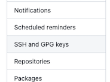
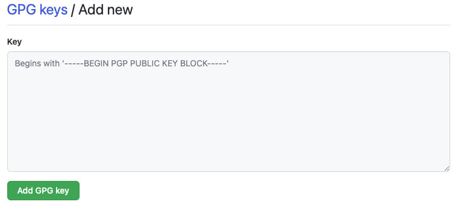

# GPG Keys

Get the GPG command line tools for your system (macOs should already have it...I think)

```
https://www.gnupg.org/download/
```

Generate a key

```
gpg --full-generate-key
```

List the keys on your system

```
gpg --list-secret-keys --keyid-format=long
```

From the list of GPG keys, copy the long form of the GPG key ID you'd like to use. In this example, the GPG key ID is 3AA5C34371567BD2:
```
$ gpg --list-secret-keys --keyid-format=long
/Users/hubot/.gnupg/secring.gpg
------------------------------------
sec   4096R/3AA5C34371567BD2 2016-03-10 [expires: 2017-03-10]
uid                          Hubot 
ssb   4096R/42B317FD4BA89E7A 2016-03-10
```

```
Paste the text below, substituting in the GPG key ID you'd like to use. In this example, the GPG key ID is 3AA5C34371567BD2:

gpg --armor --export 3AA5C34371567BD2
# Prints the GPG key ID, in ASCII armor format
```

Copy your GPG key, beginning with `-----BEGIN PGP PUBLIC KEY BLOCK-----` and ending with `-----END PGP PUBLIC KEY BLOCK-----`.


In the goto your github [user settings](https://github.com/settings/ssh/new)

Select SSH and GPG keys:



Select New SSH Key


Paste the public key into the input field



