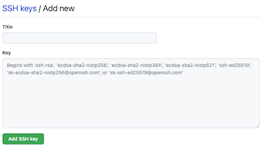

# SSH Keys

ssh keys (Secure Shell) are a way to secure, or authenticate your account for remote login.

You will use ssh keys to securely login, create, or modify code, account settings, and more using external sites and service providers.

## TOC
1. Check for existing keys
2. Create a key


## Check for existing keys

Go to your .ssh Directory

```
cd ~/.ssh
```

Check for existing keys, there should be 'id_rsa' (your private key) and 'id_rsa.pub' (your public key)
```
ls -al .
```


## Create a key

To create a key:

```
ssh-keygen -t rsa -C "your_email@example.com"
```


** you can add `-f "filename"` to set the output filename (this is useful if you need to have ssh keys for multiple clients)


```
ssh-keygen -t rsa -C "email@work_mail.com" -f "id_rsa_work_user1"
```

Follow the prompts (Just press [enter]) until  you get a random art image

```
Your identification has been saved in ~/.ssh/id_rsa.
Your public key has been saved in ~/.ssh/id_rsa.pub.
The key fingerprint is:
**:**:**:**:**:**:**:**:**:**:**:**:**:**:**:** example@e
The key's randomart image is:
+--[ RSA 2048]----+
|  .oo.           |
|         p       |
|          dd     |
|     . = = .     |
|      - t - .    |
|     -+-+-+-+    |
|     ¯\_(ツ)_/¯  |
|                 |
|                 |
+-----------------+
```


## Using SSH key


Open your public key file ```id_rsa.pub```

```
code ./id_rsa.pub
```

In the goto your github [user settings](https://github.com/settings/ssh/new)

Select SSH and GPG keys:


Select New SSH Key


copy the entire file contents (from `~/.ssh/id_rsa.pub`) and paste it into the input field of the site's ssh key



** if you gave your file a different name than 'id_rsa', it will have the name you gave it.


## Multiple accounts


  If you have multiple github accounts (maybe a personal and a work account). You may need multiple ssh keys.

  1) Create a new ssh key and set the filename
  2) upload the pub to the github account

  ### 3a) with config

  You can create an `~/.ssh/config`

  Since the connections to the remote repository will use ssh, the `@NAME` part of the path can be used to identify the correct ssh key.

  ```
	Host github.com
	  HostName github.com
	  User git
	  IdentityFile ~/.ssh/id_rsa


  Host github-COMPANY
	  HostName github.com
	  User git
	  IdentityFile ~/.ssh/id_rsa_COMPANY
  ```

Now when you checkout, or set the remote for a COMPANY repo adding `-COMPANY` to the github url will use the id_rsa_COMPANY key
```
git remote add origin git@github-COMPANY:Company/testing.git
```

or *maybe*:
```
git remote set-url origin git@github-COMPANY:Company/testing
```

### 3b) As Needed

You could also add or remove keys as needed:

```
ssh-add -D            //removes all ssh entries from the ssh-agent
ssh-add ~/.ssh/id_rsa                 // Adds the relevant ssh key
```


If doing the 'as needed' a hook could be set up in the shell to toggle the keys for you:

[Subdir paths](https://unix.stackexchange.com/questions/6435/how-to-check-if-pwd-is-a-subdirectory-of-a-given-path)

```
# TODO Source this example code

```

4) Either way you'll need to make sure that each git repo that you have checked out has the correct user config:

In the directory of the repo:

```
git config user.name "User 1"   // Updates git config user name
git config user.email "user1@workMail.com"
```


## Additional info
  - [Github ssh](https://docs.github.com/en/github/authenticating-to-github/connecting-to-github-with-ssh) && [Generating an ssh Key](https://docs.github.com/en/github/authenticating-to-github/generating-a-new-ssh-key-and-adding-it-to-the-ssh-agent)
  - [Gitlab ssh](https://dev.to/sndrx/how-to-set-up-an-ssh-key-and-use-it-in-gitlab--42p1)
  - [Bitbucket ssh](https://confluence.atlassian.com/bitbucketserver/ssh-user-keys-for-personal-use-776639793.html)


