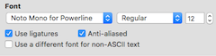

Your .zshrc should be: ```~/.zshrc```

This is now the [default in os X](https://pawelgrzybek.com/apple-changed-the-default-shell-from-bash-to-zsh-so-did-i/)

OS X
  - Install Command Line Developer Tools
  - Install [iTerm2](https://www.iterm2.com/)
  - Install ZSH
  - [Install Oh-My-Zsh](#install-oh-my-zsh)

### Install Oh-My-Zsh

```
sh -c "$(curl -fsSL https://raw.githubusercontent.com/ohmyzsh/ohmyzsh/master/tools/install.sh)"
```

## Modify your .zshrc

### Confirm that you have the correct paths:

  1. NVM (Node Version Manager)
  ```VIM
  export NVM_DIR="$HOME/.nvm"
  [ -s "$NVM_DIR/nvm.sh" ] && . "$NVM_DIR/nvm.sh"  # This loads nvm
  source ~/.nvm/nvm.sh
  ```

  Add this line to get bash completion (tab to hint/complete) for nvm commands

  ```VIM
  [ -s "$NVM_DIR/bash_completion" ] && \. "$NVM_DIR/bash_completion"  # This loads nvm bash_completion
  ```

  2. SSH_KEYS
  For some reason, sometimes this line is commented out. Uncomment it to fix issues with ssh.
  ```VIM
  # ssh
  export SSH_KEY_PATH="~/.ssh/rsa_id"
  ```

### Configure oh-my-zsh installation.

1. Set the Path to OMZ (this should be done at or near the top of your zshrc)
```VIM
export ZSH="$HOME/.oh-my-zsh"
```

2. Set the theme (if you want)
There are hundreds of themes, check out the [github page](https://github.com/ohmyzsh/ohmyzsh/wiki/Themes) for more.

In zshrc:
```VIM
# ZSH_THEME="robbyrussell" # Replace this
ZSH_THEME="agnoster" # with this ... or what ever your theme name is
```

3. Plugins

There are so many super useful plugins for zsh.
Here you can find tonnes of [awesome zsh plugins]('https://github.com/unixorn/awesome-zsh-plugins#plugins')

```VIM
plugins=(
  git
)
```
** Note that the plugins are separated by whitespace (spaces, tabs, new lines...). Do not use commas between them or it will break.


4. Load oh-my-zsh
This must be done AFTER setting the path, theme and plugins
```VIM
source $ZSH/oh-my-zsh.sh
```


### Auto Load Node Version
```VIM
# place this after nvm initialization!
autoload -U add-zsh-hook
load-nvmrc() {
  local node_version="$(nvm version)"
  local nvmrc_path="$(nvm_find_nvmrc)"

  if [ -n "$nvmrc_path" ]; then
    local nvmrc_node_version=$(nvm version "$(cat "${nvmrc_path}")")

    if [ "$nvmrc_node_version" = "N/A" ]; then
      nvm install
    elif [ "$nvmrc_node_version" != "$node_version" ]; then
      nvm use
    fi
  elif [ "$node_version" != "$(nvm version default)" ]; then
    echo "Reverting to nvm default version"
    nvm use default
  fi
}
add-zsh-hook chpwd load-nvmrc
load-nvmrc
```

## Add NPM Completion

Get bash completion (tab to hint/complete) for npm commands, even the run commands from a package.json.

```
npm completion >> ~/.zshrc
```

## Fonts

Roboto - Often recommended
```BASH
brew tap homebrew/cask-fonts && brew cask install font-robotomono-nerd-font
```

Noto - Like Roboto, but with support for more characters (I use it because it has Japanese and Korean Mono spaced fonts)
```BASH
brew cask install font-noto-nerd-font
```

Then set your chosen font in iterm's Preferences -> Profiles -> Text:
<p align="center">

</p>


There are so many fonts. These are just a couple of suggestions, but if you select another font, be sure to pick one that is patched with glyphs. [Nerd Fonts](https://github.com/ryanoasis/nerd-fonts#--) is a great repo.

## iTerm Colours
ref: [https://github.com/MartinSeeler/iterm2-material-design]([https://github.com/MartinSeeler/iterm2-material-design])

 - download the file material-design-colors.itermcolors

 - iTerm2 > Preferences > Profiles > Colors Tab

 - Click Color Presets...

 - Click Import...

 - Select the material-design-colors.itermcolors file

 - Select the material-design-colors from Load Presets...

## Directory Path too Long

  You can use [shrink path](https://github.com/ohmyzsh/ohmyzsh/tree/master/plugins/shrink-path).

  But that broke my custom theme, so I edited my theme

  ~/.oh-my-zsh/themes/agnoster.zsh-theme
  ```BASH
  prompt_dir() {
    # Shorten the Displayed Directory Path to the last 2 Directories
    # https://medium.com/@shandou/how-to-shorten-zsh-prompt-oh-my-zsh-14185f3e7ab7
    prompt_segment blue $CURRENT_FG '%2~'
  }
  ```

### References

Source: [oh my zsh + powerline fonts in vscode](https://gist.github.com/480/3b41f449686a089f34edb45d00672f28)

[https://medium.com/ayuth/iterm2-zsh-oh-my-zsh-the-most-power-full-of-terminal-on-macos-bdb2823fb04c](https://medium.com/ayuth/iterm2-zsh-oh-my-zsh-the-most-power-full-of-terminal-on-macos-bdb2823fb04c)


