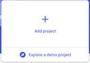
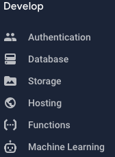

# Firebase in One Minute

## Create a Firebase Project

  1. Go to [your firebase console](https://console.firebase.google.com/).
  2. Create a project 
    
      

  3. Select 'Add Webapp', and copy the config into your project: 
   
   ```
  // Your web app's Firebase configuration
  var firebaseConfig = {
    apiKey: "abcd1234zxyx1234dfghj666666",
    authDomain: "your-app-name-here.firebaseapp.com",
    databaseURL: "https://your-app-name-here.firebaseio.com",
    projectId: "your-app-name-here",
    storageBucket: "your-app-name-here.appspot.com",
    messagingSenderId: "000000000000",
    appId: "1:102030405060:web:1234567891011",
    measurementId: "G-G123LETTERSNUMS"
  };
  ```


  4. Add / setup the features that you want.
      


## Install Firebase on your machine


## Install Firebase in your project


## Firestore

Connect to the store
```javascript
const db = firebase.firestore();
```
 Get a 'table' (collection) from the store (once)
 ```javascript
const getPosts = () => db.collection('posts').get().then((querySnapshot) => {
  querySnapshot.forEach((doc) => {
    console.log(`${doc.id} => ${doc.data()}`);
  });
});
```

Watch / Subscribe to changes (on collection)
```javascript
db.collection("posts").onSnapshot((snapshot) => {
  const mapped = mapDocs(snapshot.docs);
  myDoNextFn(mapped); // Use your own Fn
});
```

Watch / Subscribe to changes (on document)
```javascript
const docRef = postsCollection.doc(postId);
docRef.onSnapshot((snapshot) => {
  myDoNextFn(mapped); // Use your own Fn
});

```

Where
```javascript
const unsubscribe = db.collection("posts").where(someKey, '==', someValue)
  .onSnapshot(function(querySnapshot) {
    myDoNextFn(querySnapshot); // Use your own Fn
  });

// Later....
unsubscribe();

```


Add
```javascript
db.collection("posts").add(myNewPost)
.then(function() {
  console.log("Document successfully written!");
})
.catch(function(error) {
  console.error("Error writing document: ", error);
});
```

Update
```javascript
const docRef = postsCollection.doc(postId);
docRef.update(myUpdates)
.then(function() {
  console.log("Document successfully updated!");
})
.catch(function(error) {
  console.error("Error updating document: ", error);
});
```

Delete
```javascript
db.collection("posts").doc(postId).delete().then(function() {
    console.log("Document successfully deleted!");
}).catch(function(error) {
    console.error("Error removing document: ", error);
});
```

## Realtime Database


