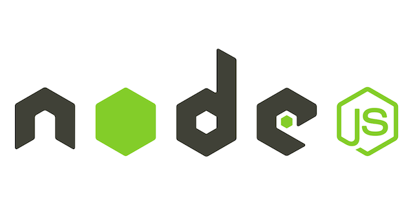

# Consolidated Code Scraps - Project Setup

[Original Source](https://github.com/amindunited/amu-spikes-monorepo/blob/project-setup/docs/project-setup/one-script.sh)

## Table Of Contents

- [Git Ignore](#gitignore)
- [Node Version](#node-version)
- [Yarn WorkSpaces](#yarn-workspaces)
- [Community Docs](#community-docs)
- [Lerna](#lerna)
- [Code Style](#code-style)
- [Git Hooks](#git-hooks)

## Gitignore


<details>
  <summary>
    Add a Gitignore File
  </summary>

```sh
curl https://raw.githubusercontent.com/github/gitignore/master/Node.gitignore -o .gitignore
```

</details>

## Node Version



<details>
  <summary>
    Create a .nvmrc
  </summary>

```sh
echo "###############################"
echo "Add Node version to .nvmrc"

node -v > .nvmrc
```

</details>

## Yarn Workspaces


<details>
  <summary>Init</summary>

```sh
echo "###############################"
echo "Initialise Yarn"

npx yarn init -y
```

</details>

<details>
  <summary>Add Workspaces to Package.json</summary>

```sh

echo "###############################"
echo "Add Workspaces to Package.json"
# This script will make the following modifications to the package.json
#   - mark the project as private.
#   - the yarn workspaces config '"workspaces":["packages/*"]'
#   - set the version to 0.0.0

PACKAGE_UPDATES=$(cat <<-END

  // Load the package.json
  let pkg=require("./package.json");

  // Reset the package version to "0.0.0"
  pkg.version="0.0.0";

  // Set the package to private (required for yarn workspaces)
  pkg.private=true;

  // Set a "workspaces" array of directory path globs for yarn workspaces
  pkg.workspaces=["packages/*"];

  // write out the modified JSON
  require("fs").writeFileSync("package.json", JSON.stringify(pkg, null, 2));
END
)

# Run the JS to modify the Package.json
node -e $PACKAGE_UPDATES

echo "
#
# EOF
# Yarn
###############################################################
"
```

</details>

## Community Docs


Help yourself, and others, by giving some info on the Code, the project, and how to help.

<details>

  <summary>
    README
  </summary>

From the [readme-md-generator](https://github.com/kefranabg/readme-md-generator)

```sh
npx readme-md-generator
```

</details>

<details>
  <summary>
    Code of Conduct
  </summary>

```sh
curl https://www.contributor-covenant.org/version/2/1/code_of_conduct/code_of_conduct.md -o ./CODE_OF_CONDUCT.md
```

</details>

<details>
  <summary>Contributing Guide</summary>

```sh
curl https://raw.githubusercontent.com/bitprophet/contribution-guide.org/master/index.rst -o ./CONTRIBUTING.md
```

</details>

## Lerna


<details>
  <summary>Init Lerna</summary>

```
yarn add lerna -D -W
```

</details>

<details>

  <summary>Add Lerna.json</summary>

```
cat > ./lerna.json <<-EOF
{
  "packages": [
    "packages/*"
  ],
  "npmClient": "yarn",
  "useWorkspaces": true,
  "version": "0.0.0",
  "command": {
    "publish": {
      "message": "chore(release): publish",
      "no-private": true
    }
  }
}
EOF
```

</details>

<details>
  <summary>Add Lerna scripts to Package.json</summary>

```sh
PACKAGE_UPDATES=$(cat <<-END
  // Load the package.json
  let pkg=require("./package.json");
  if (!pkg['scripts']) { pkg['scripts'] = {} }
  pkg['scripts']['test'] = "lerna run test --since";
  pkg['scripts']['lint'] = "lerna run lint --since";
  pkg['scripts']['version'] = "lerna version --conventional-commits --yes";
  pkg['scripts']['publish'] = "lerna publish from-git";
  // write out the modified JSON
  require("fs").writeFileSync("package.json", JSON.stringify(pkg, null, 2));
END
)

# Run the JS to modify the Package.json
node -e $PACKAGE_UPDATES

```

</details>

## Code Style


<details>

  <summary>Configuring Browsers List</summary>

```
cat > .browserslistrc <<EOL
# Browsers List Defaults
defaults
not IE 11
maintained node versions
EOL
```

</details>

<details>
  <summary>Editor Config</summary>

```sh
cat > .editorconfig <<EOL
# http://editorconfig.org
root = true
[*]
charset = utf-8
indent_style = space
indent_size = 2
insert_final_newline = true
trim_trailing_whitespace = true
[*.md]
insert_final_newline = false
EOL
```

</details>

<details>
  <summary>Eslint</summary>

```sh
rm -rf ./package-lock.json

npx eslint --init

echo "⚠️ Even if initialised with yarn, eslint init will install dependencies through npm. So the following script will remove the package-lock.json, and run yarn install."

# The EsLint team choose this path:
# https://github.com/eslint/eslint/issues/9290#issuecomment-329005046

rm -rf ./package-lock.json && yarn install
```

</details>

<details>
  <summary>Prettier</summary>

```sh

yarn add prettier -D -W
yarn add eslint-config-prettier -D -W

echo "Configuring prettier"
echo {}> .prettierrc.json

```

</details>

## Git Hooks


<details>
  <summary>Husky</summary>

````sh
yarn add husky -D -W

# The Husky docs suggest creating a prepare script like this

npm set-script prepare "husky install"

# But if that doesn't work ... just add a script to the package.json for it

# ```JSON
# {
#   "scripts": {
#     "prepare": "husky install"
#   }
# }
# ```
yarn run prepare
````

</details>

<details>
  <summary>Lint Staged</summary>

```sh
echo "Installing Lint Staged"
npx mrm@2 lint-staged
```

```sh
echo "Creating lint-staged.config"

cat > lint-staged.config.js <<EOL
module.exports = {
  "*.js": "eslint --cache --fix",
  "*.{js,css,md}": "prettier --write"
}
EOL
```

```sh
echo "⚠️ lint-staged config will now be removed from package.json"

PACKAGE_UPDATES=$(cat <<-END
  // Load the package.json
  let pkg=require("./package.json");
  // Delete the lint staged config from the package.json
  delete pkg["lint-staged"]
  // write out the modified JSON
  require("fs").writeFileSync("package.json", JSON.stringify(pkg, null, 2));
END
)

# Run the JS to modify the Package.json
node -e $PACKAGE_UPDATES
```

```sh
# echo "Pre Commit (Lint Staged Files)"
# echo "Adding pre-commit Husky hook"

# # npx husky add .husky/pre-commit "npx --no-install lint-staged"
# # Lint staged now installs itself and does not add the --no-install flag  ¯\_(ツ)_/¯
# npx husky add .husky/pre-commit ""
```

</details>

<details>
  <summary>Commit Lint</summary>

```sh
echo "Commit Lint"
yarn add @commitlint/{config-conventional,cli} -W -D

echo "module.exports = {extends: ['@commitlint/config-conventional']}" > commitlint.config.js

echo "Adding Commit Message Husky hook"
npx husky add .husky/commit-msg "npx --no-install commitlint --edit \"$1\""
```

</details>

<details>
  <summary>Commitizen</summary>

```sh
echo "Commitizen"

# - ⚠️ Had Some trouble with Commitizen, yarn husky...

# The commitizen init had trouble with installing via Yarn (Root Workspace issue)
# So
# 1. npx and npm for init
npx commitizen init cz-conventional-changelog --save-dev --save-exact
# 2. remove package-lock.json and update yarn-lock
rm -rf ./package-lock.json && yarn install
# 3. add commitizen to the root workspace
yarn add commitizen -D -W

echo "create commitizen config with conventional-changelog"
cat > .czrc <<EOF
{
  "path": "cz-conventional-changelog"
}
EOF

echo "Remove commitizen config from Package,json"
PACKAGE_UPDATES=$(cat <<-END
  // Load the package.json
  let pkg=require("./package.json");
  // Delete the lint staged config from the package.json
  delete pkg["config"]
  // write out the modified JSON
  require("fs").writeFileSync("package.json", JSON.stringify(pkg, null, 2));
END
)

# Run the JS to modify the Package.json
node -e $PACKAGE_UPDATES


echo "Adding Prepare Commit Message Husky hook"
# Create an empty prepare-commit-rule
npx husky add .husky/prepare-commit-msg ""

# Append the multi line condition
#
# - This condition will skip the Commitizen CLI
#     if the commit already has a Message
#
cat >> .husky/prepare-commit-msg <<EOF
## "\$2" is the \`-m\` or \`-message\` flag.
# If the message flag has been NOT set, use commitizen
if [ "\$2" != "message" ];then
    exec < /dev/tty && node_modules/.bin/cz --hook "\$1" "\$2" "\$3" || true
fi
EOF

```

</details>
