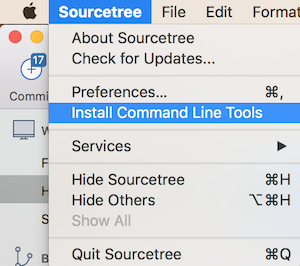

# Quick setup of developer's mac

So you have a new mac? Whatever.

Here are a few notes to help speed up installing some useful tools 

## Broswers

1. [Google Chrome](https://www.google.com/chrome/)
2. [Firefox](https://www.mozilla.org/en-GB/firefox/new/)
3. [Edge](https://www.microsoft.com/en-us/edge)

## Mobile Emulators

1. Xcode (developer tools) from the app store

	then the command-line tools:
	```
	xcode-select --install
	```

    Once Xcode is installed a link to the Ios simulator can be created by launching xcode:
      - Selecting 'xcode' menu -> 'Open Developer Tool' -> 'simulator'.
      - Once the simulator is open, drag its icon from the Launcher into the 'Applications' directory

### Command Line tools

1. Homebrew:

    ```
    ruby -e "$(curl -fsSL https://raw.githubusercontent.com/Homebrew/install/master/install)"
    ```

2. Git: 

    ```
    brew install git
    ```


3. Node:

    ```
    brew install node
    ```

	if you have permission issues:
    ```
    sudo chown -R $USER:$GROUP ~/.npm
    ```
	
	Node version management: See Managing Node Version.

4. iTerm (if you want it...but you do) [https://iterm2.com/](https://iterm2.com/)

5. add git highlighting to the terminal:

	instructions: [http://neverstopbuilding.com/gitpro](http://neverstopbuilding.com/gitpro)
	
	short version:
	
	```
	curl -o ~/.git-completion.bash 'https://raw.githubusercontent.com/git/git/master/contrib/completion/git-completion.bash'

	```

    ```
    curl -o ~/.git-prompt.sh "https://raw.githubusercontent.com/git/git/master/contrib/completion/git-prompt.sh"
    ```

 
	if you are going to follow 'iterm, with zsh and Material Theme' add the following to .bash_profile:
	
	```
	#!/bin/bash
	
	source ~/.git-completion.bash
	source ~/.git-prompt.sh
	
	alias ll='ls -lah'
	alias gg='git status -s'
	
	```

if you are NOT going to follow 'iterm, with zsh and Material Theme' add the following to .bash_profile:


    ```
    #!/bin/bash
    
    source ~/.git-completion.bash
    source ~/.git-prompt.sh
    
    
    MAGENTA="\[\033[0;35m\]"
    YELLOW="\[\033[0;33m\]"
    BLUE="\[\033[34m\]"
    LIGHT_GRAY="\[\033[0;37m\]"
    CYAN="\[\033[0;36m\]"
    GREEN="\[\033[0;32m\]"
    GIT_PS1_SHOWDIRTYSTATE=true
    export LS_OPTIONS='--color=auto'
    export CLICOLOR='Yes'
    export LSCOLORS=gxfxbEaEBxxEhEhBaDaCaD
    
    export PS1=$LIGHT_GRAY"\u@\h"'$(
    if [[ $(__git_ps1) =~ \*\)$ ]]
    # a file has been modified but not added
    then echo "'$YELLOW'"$(__git_ps1 " (%s)")
    elif [[ $(__git_ps1) =~ \+\)$ ]]
    # a file has been added, but not commited
    then echo "'$MAGENTA'"$(__git_ps1 " (%s)")
    # the state is clean, changes are commited
    else echo "'$CYAN'"$(__git_ps1 " (%s)")
    fi)'$BLUE" \w"$GREEN": "
    
    alias ll='ls -lah'
    alias gg='git status -s'
    
    ```

restart your terminal


6. [iterm, with zsh and Material Theme](./iterm-with-material-theme.md)

### Code Tools

1. [Visual Studio Code](https://code.visualstudio.com/)

      Extensions:

    - [John Papa's Angular Essentials Extension](https://marketplace.visualstudio.com/items?itemName=johnpapa.angular-essentials)
    - [gitlens](https://marketplace.visualstudio.com/items?itemName=eamodio.gitlens)
    - [Path Intellisense](https://marketplace.visualstudio.com/items?itemName=christian-kohler.path-intellisense)
    - [NPM Intellisense](https://marketplace.visualstudio.com/items?itemName=christian-kohler.npm-intellisense)
    - [SCSS Intellisense](https://marketplace.visualstudio.com/items?itemName=mrmlnc.vscode-scss)

    Add VSCode command to terminal:

    - In VSCcode open the command palette (cmd + shift + p )
    - Strart typing ```shell command```....
    - click on ```SHELL Command: Install 'code' command in PATH```


2. sourcetree [https://www.sourcetreeapp.com/](https://www.sourcetreeapp.com/)

    ** To install commandline tools

      
